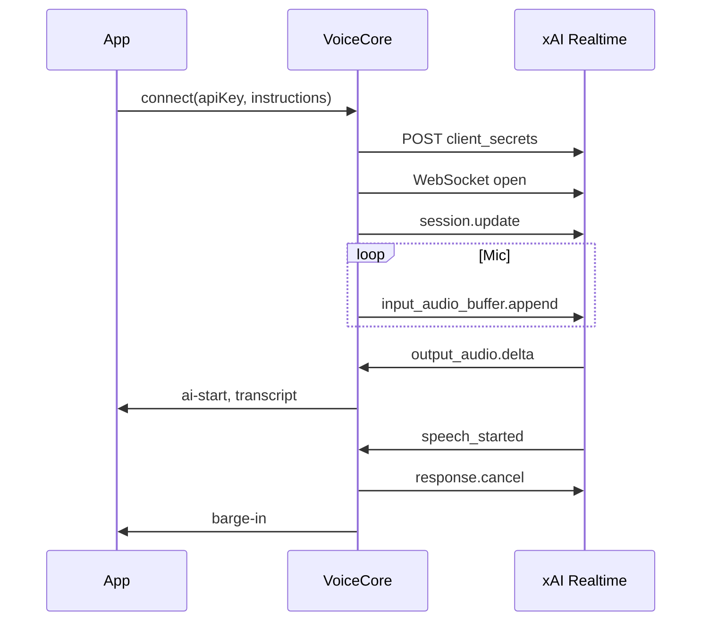

# VoiceCore

Minimal real-time voice conversation engine for **Electron** and browser renderers, built for the **xAI Realtime API** (WebSocket + PCM16).

VoiceCore handles only speech I/O: microphone capture, echo management, barge-in, natural turn-taking, and playback. It does **not** include tools, memory, agency, or task logic — plug those on top via events.

## Quick start

```bash
cd modules/voicecore/test-app
npm install
# Optional Krisp noise filter:
# npm install @livekit/krisp-noise-filter livekit-client

# Set your API key in the test UI, or:
# set XAI_API_KEY=xai-...

npm start
```

`npm start` launches **Electron only** — the UI static server (including Krisp `/npm` modules) runs **inside** the app. One terminal, one command. Press **Ctrl+C** to quit when the terminal is in the foreground, or close the app window.

**Browser-only** (no Electron):

```bash
npm run dev
# Then open http://127.0.0.1:5180/test-ui/  or  npm run open
```

## Architecture

```
Microphone → EchoGate (Krisp | AEC3) → AudioPipeline (gates) → WebSocket → xAI
xAI audio deltas → AudioPipeline playback → Speakers
VoiceCore orchestrates state, barge-in, VAD sync, and events
```

See [docs/design.md](docs/design.md) for the full specification.

## Usage

```javascript
import { VoiceCore } from "./index.js";

const voice = new VoiceCore({
  config: {
    vad: { silenceDurationMs: 1500 },
    session: { defaultVoice: "eve" },
  },
});

voice.addEventListener("state-change", (e) => {
  console.log(e.detail.from, "→", e.detail.to, e.detail.reason);
});

voice.addEventListener("user-speech-start", () => console.log("User talking"));
voice.addEventListener("user-speech-end", () => console.log("User paused"));
voice.addEventListener("barge-in", (e) => console.log("Interrupted", e.detail.source));
voice.addEventListener("ai-start", () => console.log("AI speaking"));
voice.addEventListener("ai-end", () => console.log("AI done"));
voice.addEventListener("transcript", (e) => {
  const { role, text, final } = e.detail;
  if (final) console.log(role, ":", text);
});

// Call during a user click so AudioContext can start
await voice.prepareMic();

await voice.connect({
  apiKey: "xai-...",
  voice: "eve",
  instructions: "You are a concise, friendly voice assistant.",
  requestIntro: true,
});

// Later
voice.sendText("What is the weather like?");
await voice.disconnect();
```

## API reference

### `VoiceCore`

| Method | Description |
|--------|-------------|
| `prepareMic()` | Request mic permission during a user gesture |
| `connect({ apiKey, voice?, instructions?, requestIntro? })` | Start session |
| `disconnect()` | Stop session and release resources |
| `sendText(text)` | Send a text turn |
| `getState()` | Current state string |
| `getLevels()` | `{ mic, vol, bands }` for visualizers |
| `getEchoMode()` | `"krisp"` or `"browser"` |
| `getEchoInfo()` | `{ mode, preferKrisp, krispError }` |

Krisp packages are loaded from `node_modules` via the embedded UI server (`/npm/…` + import map in `test-ui/index.html`). Run `npm install` in `modules/voicecore/test-app/`, then `npm start` with **Krisp** checked.
| `isMicGateOpen()` | Whether uplink is streaming PCM |

### Events

| Event | `detail` |
|-------|----------|
| `state-change` | `{ from, to, reason }` |
| `user-speech-start` | `{ source: "server" }` |
| `user-speech-end` | `{}` |
| `barge-in` | `{ source: "server" }` |
| `barge-in-aborted` | `{}` — false local barge recovered |
| `ai-start` | `{}` |
| `ai-end` | `{}` |
| `transcript` | `{ role, text, final }` |
| `error` | `{ message, cause? }` |

### States

`idle` → `connecting` → `listening` ↔ `speaking` / `thinking` / `barge_in`

Mic stays **hot** in `listening`, `speaking`, `thinking`, and `barge_in`.

## xAI Realtime integration

VoiceCore embeds a slim transport (`realtime-transport.js`) that mirrors SentienceTool’s proven flow:

1. **POST** `https://api.x.ai/v1/realtime/client_secrets` with `grok-voice-latest`
2. **WebSocket** `wss://api.x.ai/v1/realtime?model=grok-voice-latest`  
   Subprotocol: `xai-client-secret.<secret>`
3. **session.update** — instructions, voice, `server_vad`, PCM16 @ 24 kHz (no tools)
4. **Uplink** — `input_audio_buffer.append` (base64 PCM16)
5. **Downlink** — `response.output_audio.delta`
6. **Barge-in** — `response.cancel` when user speaks during AI output



### Using your own WebSocket layer

If you already manage the xAI session, you can use submodules directly:

```javascript
import { AudioPipeline } from "./audio-pipeline.js";
import { EchoGate } from "./echo-gate.js";
import { mergeConfig } from "./config.js";

// Wire audio.onMicPcm → your ws.send(append)
// Feed server messages → voice.handleServerMessage(msg)
```

`handleServerMessage` expects the same event types SentienceTool handles for audio and VAD.

## Configuration

Override defaults via constructor:

```javascript
new VoiceCore({
  config: {
    vad: {
      thresholdListen: 0.85,
      thresholdBargeIn: 0.94,
      silenceDurationMs: 1500,
    },
    speech: { preRollMs: 350, hangoverMs: 1200 },
    barge: { falseRecoveryMs: 600 },
    echo: { preferKrisp: false },
  },
});
```

All defaults live in [`config.js`](config.js).

### Test app tuning drawer

The Electron/browser test UI includes a **Tuning** panel (right drawer) with sliders, presets, and live apply:

| Preset | Use |
|--------|-----|
| **Patient** | Longer pauses, softer gate — fewer clipped sentences |
| **Snappy** | Faster turn-end |
| **Default** | Reset to `config.js` baselines |

- Sliders debounce and call `voice.setConfig()` + `applySessionVad()` when connected.
- **Hold to think** pad — `setHoldDeferred(true)` while pressed (blocks mic uplink and defers `speech_stopped`).
- **Gate threshold** readout — live adaptive speech gate level.
- **Copy config JSON** — export overrides for SentienceTool integration.

### Symptom → dial

| Symptom | Try first |
|---------|-----------|
| Short pause cuts sentence | ↑ Silence before end-of-turn, ↑ Utterance latch, ↑ Speech hangover |
| AI responds before you finish | ↑ Silence duration; use **Hold to think** |
| Quiet last words missing | ↑ **Mic gain**, ↓ Min RMS, ↓ Noise margin, ↑ Hangover |
| Listen at minimum still weak | **Listen** is server VAD only — use waveform + **Gain** / Min RMS for local gate |
| False barge-in while AI talks | ↑ Barge VAD threshold, tune echo sliders |
| Barge heard in transcript but AI silent | Fixed: clear drop flag on `response.created`; watchdog `response.create` |
| AI talks over you during barge | Lower **Barge VAD** (try 0.86–0.88); raise **Gain** so your voice passes the local gate during playback |
| AI cuts itself off mid-sentence | Usually false barge from speaker bleed — raise **Barge VAD** (0.92+) or echo sliders; ensure Gain is not pumping bleed |
| Room noise triggers speech | ↑ Listen threshold; install Krisp (reconnect) |

### Runtime API

```javascript
voice.getConfig();
voice.setConfig({ vad: { silenceDurationMs: 2200 } });
voice.applySessionVad(); // push VAD to xAI when connected
voice.setHoldDeferred(true); // thinking pause
voice.getDebugInfo(); // micGateOpen, speechGateThreshold, echoMode
```

## Optional Krisp

```bash
npm install @livekit/krisp-noise-filter livekit-client
```

Krisp runs as a LiveKit track processor. If import or init fails, VoiceCore falls back to browser `echoCancellation` plus the software RMS/frequency gate.

## Integrating with SentienceTool

1. Import VoiceCore from `./index.js` (or from `modules/voicecore/src/` once extracted)
2. Replace `AudioPipeline` + voice sections of `XaiRealtimeAgent` with a `VoiceCore` instance
3. Keep `tool-router`, memory, and art bridge in the agent
4. Map `state-change` / levels to visualiser params

This refactor is intentionally **out of scope** for the initial VoiceCore package — validate behavior in the test app first.

## Module map

| File | Role |
|------|------|
| `index.js` | `VoiceCore` orchestrator |
| `audio-pipeline.js` | Capture, gates, playback |
| `state-machine.js` | Conversation states |
| `echo-gate.js` | Krisp + AEC + software gate |
| `config.js` | Thresholds |
| `realtime-transport.js` | xAI WebSocket |
| `util.js` | PCM / base64 helpers |

## License

Same as parent CC3_Projects repository.
