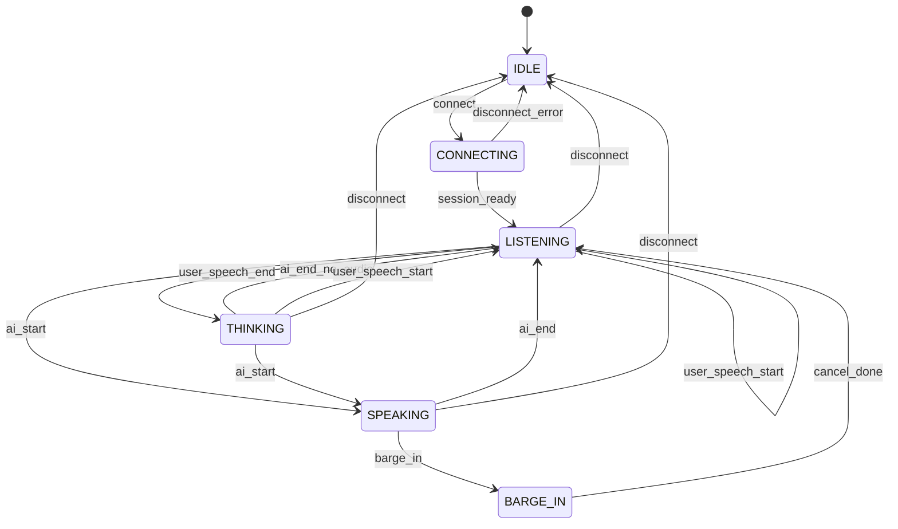

# VoiceCore — Design Specification

**Version:** 1.1  
**Date:** May 2026  
**Status:** Initial implementation + test UI tuning & hold

VoiceCore is a minimal, focused real-time voice conversation engine for Electron and browser renderers. It handles speech I/O only: microphone capture, echo management, barge-in, natural turn-taking, and xAI Realtime WebSocket transport. It does not include tools, memory, agency, or task processing.

---

## 1. Goals and non-goals

### Goals

| Goal | Detail |
|------|--------|
| **Clean speech I/O** | PCM16 uplink/downlink @ 24 kHz via xAI Realtime WebSocket |
| **Natural interruption** | Always-hot mic during AI speech; server + local barge-in |
| **Echo management** | Krisp (optional) → browser AEC3 → RMS/frequency software gate |
| **Turn-taking** | Server VAD + local speech gate + utterance latch for mid-sentence pauses |
| **Modular events** | `EventTarget` API so agents plug tools/memory on top |
| **Test harness** | Standalone Electron app under `voicecore/` |

### Non-goals

| Non-goal | Reason |
|----------|--------|
| Tool calling / function routing | Belongs in SentienceTool `tool-router.js` |
| Memory, organizer REST, session persistence | Agent layer |
| Art param bridge (`listen`, `speak`, `vol`) | Consumer maps VoiceCore events |
| WebRTC transport | xAI integration uses WebSocket + PCM (see SentienceTool) |
| Local wake word | Future module |

---

## 2. State machine



| State | Meaning |
|-------|---------|
| `IDLE` | No active session |
| `CONNECTING` | Fetching client secret, opening WebSocket |
| `LISTENING` | Mic hot; waiting for user or after AI finished |
| `SPEAKING` | Assistant audio playing or active response |
| `THINKING` | User finished speaking (`speech_stopped`); model processing |
| `BARGE_IN` | Transient: user interrupted AI; cancel in flight |

Mic uplink is enabled in `LISTENING`, `SPEAKING`, `BARGE_IN`, and `THINKING`. The pipeline never blocks the mic solely because the AI is speaking.

---

## 3. Event catalog

VoiceCore extends `EventTarget` and emits:

| Event | `detail` | When |
|-------|----------|------|
| `state-change` | `{ from, to, reason }` | Any state transition |
| `user-speech-start` | `{ source: "server" \| "local" }` | `input_audio_buffer.speech_started` or confirmed local barge |
| `user-speech-end` | `{}` | `input_audio_buffer.speech_stopped` |
| `barge-in` | `{ source }` | Interrupt during `SPEAKING` |
| `barge-in-aborted` | `{}` | Local tentative barge failed server confirmation |
| `ai-start` | `{}` | First output audio delta |
| `ai-end` | `{}` | Playback idle and no active server response |
| `transcript` | `{ role, text, final }` | User/assistant transcript deltas or finals |
| `error` | `{ message, cause? }` | WS, mic, or session failures |
| `hold-change` | `{ active: boolean }` | Mouse-hold defer on/off |

Consumers (e.g. SentienceTool) attach listeners and drive UI, tools, and memory without modifying VoiceCore internals.

---

## 3b. Mouse hold (thinking pause)

While `setHoldDeferred(true)`:

- Mic uplink is suppressed (`shouldSendMic` → false).
- `input_audio_buffer.speech_stopped` does not end the user turn (no `THINKING`); may send `response.cancel` if a response was pending.
- On release, normal VAD and uplink resume.

Test UI: **Hold to think** pad (`mousedown` / `touchstart` → hold, `mouseup` / `touchend` → release).

---

## 3c. Live tuning API

| Method | Behavior |
|--------|----------|
| `getConfig()` | Clone of active config |
| `setConfig(partial)` | Deep-merge partial overrides |
| `applySessionVad()` | Force `session.update` with current `turn_detection` |
| `getDebugInfo()` | `micGateOpen`, `speechGateThreshold`, `noiseFloorRms`, `holdDeferred`, `echoMode` |

Test UI stores overrides in `localStorage` (`voicecore:tuning-overrides`) and applies **Patient** / **Snappy** presets.

---

## 4. Echo stack

Processing order for microphone input:

1. **Krisp (optional)** — `@livekit/krisp-noise-filter` via `livekit-client` `createLocalAudioTrack` + `setProcessor`. Produces a cleaned `MediaStream`. Dynamic import; falls through on failure.
2. **Browser AEC3** — `getUserMedia` constraints: `echoCancellation: true`, `noiseSuppression: true`, `autoGainControl: false`.
3. **Software echo gate (during SPEAKING)** — Drop mic chunks where RMS is below estimated speaker bleed: `micRms >= max(outputVol, 0.04) * 1.35 + 0.07`.
4. **Frequency assist (optional)** — Speech band (300–3400 Hz) energy ratio mic vs output must exceed `config.echo.freqRatioMin`.

`EchoGate` exposes `init()`, `getStream()`, `shouldForwardMic(samples, assistantActive)`, `setOutputLevel(vol)`, `destroy()`.

---

## 5. Barge-in and false-barge-in recovery

### Primary (server)

On `input_audio_buffer.speech_started` while assistant is active:

1. Emit `barge-in`
2. Stop playback queue
3. Send `response.cancel` only if `serverResponseActive` (between `response.created` and `response.done`)
4. Transition `SPEAKING` → `BARGE_IN` → `LISTENING`

### Secondary (local tentative)

During `SPEAKING`, if echo gate passes for `localConfirmMs` consecutive processor frames:

- Mark tentative barge
- Local confirm **pauses playback** only; `response.cancel` runs when server sends `speech_started`.
- During assistant playback, mic uplink requires **echo gate + local speech gate** (prevents self-cutoff from bleed).
- If server confirms within `serverConfirmMs` → full barge-in (`performBargeIn`).
- If not → **false-barge-in recovery** after `max(falseRecoveryMs, serverConfirmMs)`:
  - Clear tentative flag
  - Resume playback if queue non-empty
  - Emit `barge-in-aborted`
  - Return to `SPEAKING` if audio remains

### VAD threshold sync

When assistant output is active, `session.update` sets `turn_detection.threshold` to **thresholdBargeIn** (default **0.88**); otherwise **thresholdListen** (0.85). Lower barge threshold = easier interrupt; raise if speaker bleed causes false barges.

After barge-in, **`dropActiveResponse` is cleared on `response.created`** so the next assistant reply is not swallowed. If the server never starts a response, a **4.5s watchdog** sends `response.create`.

---

## 6. Server VAD vs local gates

| Layer | Role |
|-------|------|
| **Server VAD** | Ends utterance after `silence_duration_ms` (default 1500 ms); fires `speech_started` / `speech_stopped` |
| **Adaptive speech gate** | Drops silent uplink between utterances; reduces bandwidth |
| **Pre-roll (350 ms)** | Buffers audio before gate opens; flushed on speech onset |
| **Hangover (1200 ms)** | Keeps sending after RMS drops |
| **Utterance latch (2000 ms)** | While server considers user speaking, bypass speech gate for mid-sentence pauses |

Local gates do not replace server VAD; they optimize uplink and echo rejection.

---

## 7. xAI Realtime message matrix

### Outbound (client → server)

| Type | Purpose |
|------|---------|
| `session.update` | Instructions, voice, turn_detection, audio format (no tools) |
| `input_audio_buffer.append` | Base64 PCM16 mic chunks |
| `conversation.item.create` | User text message |
| `response.create` | Request model turn (e.g. intro) |
| `response.cancel` | Barge-in / interrupt |

### Inbound (server → client) — handled by VoiceCore

| Type | Action |
|------|--------|
| `response.output_audio.delta` / `response.audio.delta` | Enqueue playback; `ai-start` on first |
| `response.output_audio_transcript.delta` | Emit `transcript` assistant partial |
| `response.output_audio_transcript.done` | Emit `transcript` assistant final |
| `input_audio_buffer.speech_started` | `user-speech-start`; barge-in if speaking |
| `input_audio_buffer.speech_stopped` | `user-speech-end`; → THINKING |
| `conversation.item.input_audio_transcription.completed` | `transcript` user final |
| `response.created` | Mark `serverResponseActive` |
| `response.done` | Clear active response; may trigger `ai-end` |
| `error` | Emit `error` (ignore benign cancel errors) |

---

## 8. Integration contract (SentienceTool)

```javascript
import { VoiceCore } from "../../voicecore/src/index.js";

const voice = new VoiceCore({ config: { vad: { silenceDurationMs: 1500 } } });

voice.addEventListener("barge-in", () => { /* optional agent hook */ });
voice.addEventListener("transcript", (e) => {
  panel.append(e.detail.role, e.detail.text, e.detail.final);
});
voice.addEventListener("state-change", (e) => {
  bridge.apply(mapStateToArtParams(e.detail.to));
});

await voice.connect({
  apiKey,
  voice: "eve",
  instructions: launchInstructions,
  requestIntro: true,
});
```

**Agent layer retains:** tool definitions, `function_call_output`, memory, task tracker, art ready buffer, telemetry.

**VoiceCore retains:** mic, playback, echo, barge-in, WS audio session, VAD sync.

---

## 9. Known limitations

| Limitation | Notes |
|------------|-------|
| Krisp requires `livekit-client` | ~6MB WASM; optional peer dependency |
| `ScriptProcessorNode` deprecated | Matches SentienceTool; AudioWorklet migration path in README |
| No WebRTC | xAI path is WebSocket + PCM16 only |
| Krisp Cloud-oriented | May require LiveKit-compatible runtime; fallback always available |
| Electron renderer only | Mic via Web APIs; no main-process capture |

---

## 10. File map

| File | Responsibility |
|------|----------------|
| `src/index.js` | `VoiceCore` orchestrator |
| `src/audio-pipeline.js` | Capture, gates, playback, levels |
| `src/state-machine.js` | States and transitions |
| `src/echo-gate.js` | Krisp + AEC + software gate |
| `src/config.js` | Default thresholds |
| `src/realtime-transport.js` | xAI WebSocket (no tools) |
| `src/util.js` | PCM/base64 helpers |
| `test-ui/` | Electron harness |
