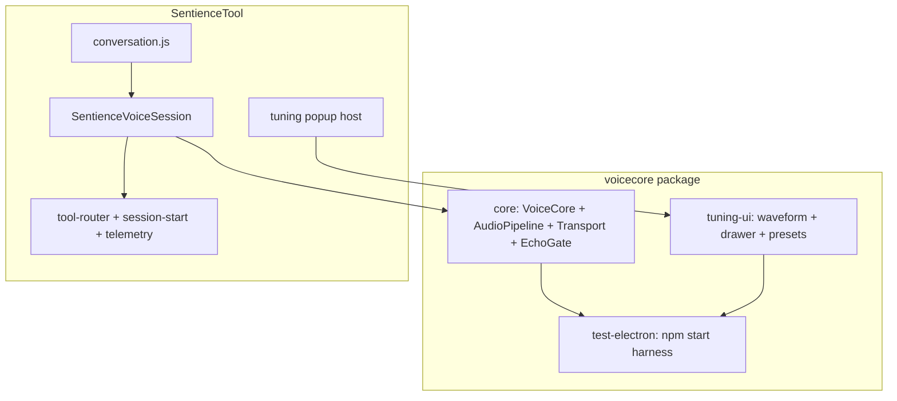

# VoiceCore → SentienceTool Integration Plan

**Goal:** Ship VoiceCore (speech I/O + tuning popup + gate waveform) as a **reusable module** that SentienceTool adopts, while keeping VoiceCore’s **standalone test app** as the place to refine acoustics without touching gallery, memory, tools, or art.

**Principle:** VoiceCore stays **speech-only**. SentienceTool keeps **agency** (tools, memory, organizer, art bridge, telemetry). The plugin is **UI + adapter**, not a second copy of `xai.js`.

---

## 1. Target architecture



| Layer | Owns |
|-------|------|
| **voicecore/core** | Mic, playback, gates, barge-in, xAI PCM WebSocket, `EventTarget` events, config |
| **voicecore/tuning-ui** | Optional popup: sliders, presets, Krisp note, mic waveform |
| **voicecore/test-electron** | Regression harness (current `voicecore/` app) |
| **SentienceVoiceSession** | Tools, intro buffer, art `ready:1`, task tracker, phase labels, `emitParams` → art |
| **conversation.js** | Wires chat, stats HUD, hold-pad, popup trigger — **thin** |

---

## 2. Package layout (recommended)

Reorganize `voicecore/` into a small monorepo **without** moving SentienceTool yet:

```
voicecore/
  package.json              # workspaces: ["packages/*", "apps/test-electron"]
  packages/
    core/
      src/                  # today’s voicecore/src (index, audio-pipeline, …)
      package.json          # name: "@voicecore/core" or "voicecore"
    tuning-ui/
      src/                  # tuning-panel, tuning-spec, mic-waveform, styles
      package.json          # name: "@voicecore/tuning-ui"
  apps/
    test-electron/          # today’s electron/ + test-ui/ shell
      package.json
```

**SentienceTool** (phase 2+):

```json
"dependencies": {
  "voicecore": "file:../voicecore/packages/core",
  "@voicecore/tuning-ui": "file:../voicecore/packages/tuning-ui"
}
```

Or npm workspaces at repo root (`CC3_Projects`) if you prefer one lockfile later.

**Why split core vs tuning-ui:** Sentience can ship voice without the debug popup in production builds; test app and power users get the full panel.

---

## 3. Public APIs to define (contracts)

### 3.1 Core — `VoiceCore` (already exists; document as stable)

- `connect({ apiKey, voice, instructions, requestIntro })`
- `disconnect()`, `setConfig()`, `getConfig()`, `applySessionVad()`
- `setHoldDeferred()`, `getMicMonitorFrame()`, `getDebugInfo()`, `getEchoInfo()`
- Events: `state-change`, `transcript`, `barge-in`, `user-speech-start/end`, `ai-start/end`, `error`, `hold-change`

**Do not add** tools, memory, or art params to core.

### 3.2 Tuning UI — `createVoiceTuningPopup(options)`

```typescript
// packages/tuning-ui/src/index.js
createVoiceTuningPopup({
  getVoice: () => VoiceCore | null,
  anchor?: HTMLElement,           // optional; default floating button
  mode?: "drawer" | "modal",      // Sentience: modal/popover over conversation
  storageKey?: string,             // localStorage overrides
  onConfigChange?: (overrides) => void,
  initialCollapsed?: boolean,
}) => {
  open(), close(), toggle(), destroy(),
  root: HTMLElement,
  syncGain(n),
}
```

Exports: presets (`stable`, `patient`, `snappy`), `TUNING_SPECS`, Copy JSON.

### 3.3 Sentience adapter — `SentienceVoiceSession` (new)

Implements the **same callback surface** `conversation.js` already expects from `XaiRealtimeAgent`:

| Existing callback | Source after migration |
|-------------------|------------------------|
| `onPhase` | Map `VoiceCore` state + tool queue → `PHASE.*` strings |
| `onParams` | `audio.sampleLevels()` + phase → `{ listen, speak, think, mic, vol, vols }` |
| `onTranscript` | Forward `transcript` events |
| `onSystem` / `onJobLine` | Unchanged (tools, task tracker) |
| `start(record, apiKey)` | `session-start` then `voice.connect()` + tool `session.update` |

**Composition:**

```
SentienceVoiceSession
  ├── VoiceCore              // speech I/O
  ├── RealtimeTransport ext  // OR subclass: inject tools into session.update
  ├── ToolQueue              // from current xai.js (keep here)
  ├── IntroBuffer            // art ready:1 — keep here
  └── SessionTelemetry       // existing module
```

---

## 4. What to replace vs keep

| SentienceTool file | Action |
|--------------------|--------|
| `agent/audio.js` | **Replace** with `@voicecore/core` AudioPipeline (delete duplicate after parity) |
| `agent/xai.js` | **Shrink** to `SentienceVoiceSession`: tools + intro + phase mapping; delegate I/O to VoiceCore |
| `agent/state.js` | **Keep** — map VoiceCore `STATE` → visualiser phases |
| `ui/conversation.js` | **Thin** — swap agent ctor + mount tuning popup |
| `visualiser/mock-panel.js` | **Keep** for art debug; optional link vol-decay to core config |
| `chat/panel.js` | **Keep** — start/stop calls adapter |
| `agent/tool-router.js` | **Keep** — unchanged |
| `electron/*` | **Keep** — no audio in main; optional: embed static server like voicecore test app |

| VoiceCore test app | Action |
|--------------------|--------|
| `test-ui/app.js` | **Keep** as minimal consumer of core + tuning-ui |
| `test-ui/*` | **Move** shared widgets → `packages/tuning-ui` |

---

## 5. Phased rollout (most effective order)

### Phase 0 — Stabilize baseline (1–2 days)

- [ ] Tag current voicecore “stable” config as default (done in repo).
- [ ] Add `docs/integration-plan.md` checklist items to issues or project board.
- [ ] Document parity matrix: Sentience `audio.js` vs VoiceCore `audio-pipeline.js` (constants, barge, hold).

**Exit:** Test app passes manual barge-in / no self-cutoff / Krisp path checklist.

### Phase 1 — Extract packages (2–4 days)

- [ ] Create `packages/core` and `packages/tuning-ui` without behavior changes.
- [ ] Point `apps/test-electron` imports at packages.
- [ ] Single `npm test` / `npm start` from `apps/test-electron`.
- [ ] Export `createVoiceTuningPopup` with **modal** mode + floating ⚙ button.

**Exit:** `npm start` in test app identical to today; tuning-ui importable as `import { createVoiceTuningPopup } from '@voicecore/tuning-ui'`.

### Phase 2 — Sentience adapter behind flag (3–5 days)

- [ ] Add `SentienceVoiceSession` in `SentienceTool/src/voice/sentience-voice-session.js`.
- [ ] Feature flag: `localStorage` or `record.meta.useVoiceCore === true` / URL `?voicecore=1`.
- [ ] Wire `conversation.js` to use adapter when flag on.
- [ ] **Transport:** extend VoiceCore transport hook to send **tools** in `session.update` (move only WS message wiring, not tool *handlers*).
- [ ] Map events → existing callbacks; verify art params still animate.

**Exit:** Full Sentience session (tools, write_file, intro) works with flag on; off = legacy `xai.js`.

### Phase 3 — Tuning popup in Sentience (1–2 days)

- [ ] Add ⚙ control on conversation chrome (near stats HUD or chat header).
- [ ] Popup uses same `storageKey` prefix `sentience:voice-tuning` (separate from test app).
- [ ] Show echo path + gate status in popup (reuse `getEchoInfo` / `getDebugInfo`).
- [ ] Do **not** block art iframe; modal overlay with pointer-events scoped.

**Exit:** Operators can tune during live session without mock-panel constants.

### Phase 4 — Deprecate duplicate audio (2–3 days)

- [ ] Remove `SentienceTool/src/agent/audio.js` when level/gate parity confirmed.
- [ ] Delete dead code paths in `xai.js` (or remove file, rename adapter).
- [ ] Default flag **on** for internal dogfood; one release with flag **off** fallback.

**Exit:** One audio implementation; CI smoke: connect → intro → barge → tool call.

### Phase 5 — Optional polish

- [ ] Root workspace `package.json` linking voicecore + SentienceTool.
- [ ] Sentience Electron embeds UI server (like voicecore) — one `npm start`.
- [ ] Production build strips tuning-ui from bundle (tree-shake / dynamic import).

---

## 6. Transport + tools (critical design choice)

**Recommended:** Keep tool **handling** in Sentience; extend VoiceCore transport via **plugins**:

```javascript
// packages/core — optional hook
transport.configureSession({
  tools: buildSessionToolDefinitions(record),
  instructions: buildLaunchInstructions(record),
});
```

`SentienceVoiceSession` passes tool definitions into `connect()` options; VoiceCore forwards them in `session.update` but never executes tools.

**Avoid:** Copying `tool-router` into voicecore (violates non-goals).

---

## 7. Popup UX in Sentience

| Element | Placement |
|---------|-----------|
| Open control | Icon button in conversation toolbar (next to Start/Stop or stats) |
| Container | Fixed right or center modal, ~460px wide, same CSS variables as Sentience dark theme |
| Waveform | Top of modal — live `getMicMonitorFrame()` |
| Presets | Stable / Patient / Snappy / Default |
| Apply | Sliders auto-apply; “Push VAD” unchanged |
| Close | Esc + backdrop click |

**Hold to think:** Keep on visualiser in Sentience (existing UX); VoiceCore `setHoldDeferred` already supports it — wire pointer events in `conversation.js` only.

---

## 8. Testing strategy

| Where | What |
|-------|------|
| **voicecore test app** | Acoustics, barge, Krisp, presets, regression screenshots |
| **Sentience + flag** | Tools, intro buffer, art params, telemetry $, gallery → conversation |
| **Automated (later)** | Playwright: connect mock WS; unit: gate math, state machine |

**Parity tests before Phase 4:**

- Same RMS gate behavior during AI speak
- `holdDeferred` suppresses uplink
- Barge-in cancels + new user turn gets reply
- Levels `{ mic, vol, vols }` within tolerance vs old agent

---

## 9. Risks and mitigations

| Risk | Mitigation |
|------|------------|
| Two transports diverge | One `realtime-transport.js` in core; Sentience only adds `session.update` fields |
| Bundle size (Krisp/livekit) | Dynamic import in echo-gate (already); optional in Sentience prod build |
| Phase mapping wrong | Table: `VoiceCore STATE` → `PHASE` in adapter unit test |
| Intro buffer / art ready | Keep in adapter, not core |
| Feature flag forever | Remove legacy `xai.js` only after Phase 4 dogfood |

---

## 10. Success criteria

1. **VoiceCore test app** remains the fast loop for tuning (no Sentience required).
2. **Sentience** runs a full manifest session with VoiceCore I/O and **optional tuning popup**.
3. **No duplicated** `audio.js` after Phase 4.
4. **Stable preset** values work in both apps via shared `tuning-spec` presets.
5. New engineers: read `integration-plan.md` + `design.md`; one flag to try integration.

---

## 11. Suggested first implementation PR (smallest useful slice)

**PR1 — Package extract only** (no Sentience changes):

- `packages/core`, `packages/tuning-ui`, test app consumes both.

**PR2 — Sentience flag + adapter skeleton**:

- Connect/disconnect/transcript/params only; tools still stubbed or partial.

**PR3 — Full tools + popup**:

- Complete `SentienceVoiceSession` + tuning modal.

This order avoids a big-bang rewrite and keeps VoiceCore testable throughout.

---

## 12. Open decisions (pick before Phase 2)

1. **Package names:** `voicecore` vs `@voicecore/core` scoped?
2. **Repo layout:** Nested packages under `voicecore/` vs top-level `packages/voicecore` in monorepo?
3. **Default in Sentience:** opt-in flag vs opt-out after dogfood?
4. **Mock panel:** Retain vol-decay only, or fold all debug into tuning popup?

---

*Last updated: May 2026 — aligns with VoiceCore 1.1 design and SentienceTool `XaiRealtimeAgent` / `conversation.js` wiring.*
